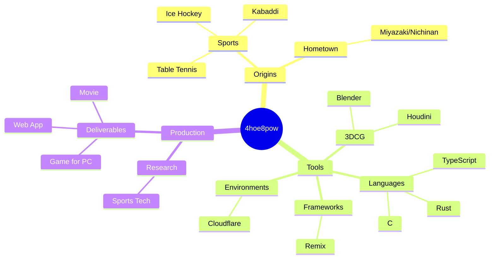

# 4how8poe

## GitHub Stats

  
  

## Mindmap

```mermaid
mindmap
  root((4hoe8pow))
    Origins
      Sports
        Table Tennis
        Ice Hockey
        Kabaddi
      Hometown
        Miyazaki/Nichinan  
    Tools
      3DCG
        Blender
        Houdini
      Languages
        C
        Rust
        TypeScript
      Frameworks
        Remix
      Environments
        Cloudflare
    Production
      Research
        Sports Tech
      Deliverables
        Game for PC
        Web App
        Movie
```
